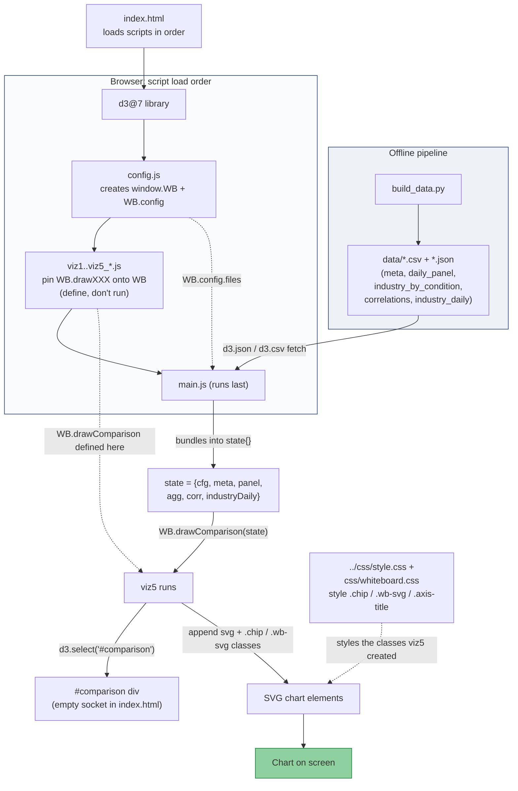

# Whiteboard Architecture — How the Files Connect

This document explains how the STATS 401 whiteboard app is wired together: how
`index.html`, the `js/*.js` files, the CSS, and the data files cooperate to put a
chart on screen. It uses **viz5 (the Comparison chart)** as the worked example.

The core idea: nothing is imported/exported in the modern ES-module sense. The files
communicate through three shared channels:

1. **The browser global scope** — a single `window.WB` object every file reads and writes.
2. **The DOM** — empty `<div>`s with known `id`s that the JS fills in.
3. **CSS class names** — the JS creates elements with classes; the CSS styles those classes.

`<script>` load order guarantees `config → viz → main`.

---

## The five charts (what each answers)

The whole app answers one master question: **How does industry performance differ across
market conditions?** Four conditions come from two signals — market direction (S&P 500
daily return up/down) and market fear (VIX split at its median, 16.99 → Calm/Volatile):
**Calm-Up, Calm-Down, Volatile-Up, Volatile-Down**.

| # | View | Renders | Question it answers |
|---|------|---------|---------------------|
| 1 | **Timeline** | S&P 500 line + VIX line over ~10 yrs, with a per-day condition ribbon | *When* did each market condition occur, and how do price and volatility move together? |
| 2 | **Conditions scatter** | Each day as a dot: x = S&P return, y = VIX, coloured by condition, with median + 0% reference lines | *What defines* the four conditions, and how are volatility and return related? |
| 3 | **Heatmap** | 12 industries × 4 conditions grid; colour = avg (or risk-adjusted) return | *Which industries* perform well/badly in each condition? (core deliverable) |
| 4 | **Network** | Force-directed graph; industries linked when correlation exceeds a threshold | Do industries *move together* more in some conditions (crisis contagion)? |
| 5 | **Comparison** | Cumulative growth of $1 per industry; toggle chips to compare | Over the long run, how did each industry *reward* an investor? |

---

## The load order (set by index.html)

Scripts at the bottom of `index.html` load top-to-bottom, and **order matters**:

```html
<script src=".../d3@7"></script>              <!-- 1. the D3 library -->
<script src="js/config.js"></script>          <!-- 2. creates window.WB + WB.config -->
<script src="js/viz1_timeline.js"></script>
<!-- ... -->
<script src="js/viz5_comparison.js"></script> <!-- 3. attaches WB.drawComparison -->
<script src="js/main.js"></script>            <!-- 4. runs LAST: loads data, calls everything -->
```

Each viz file only **defines** a function. `main.js` is the only file that actually
runs work on page load.

---

## The five-link chain for viz5

**① The empty socket (index.html)** — contributes two empty `<div>`s with known IDs:

```html
<section id="viz5">
    <div id="comparison-controls"></div>
    <div id="comparison"></div>   <!-- the empty box viz5 fills -->
</section>
```

**② The shared namespace (config.js)** — loads first, so the global exists before anything else:

```js
window.WB = window.WB || {};   // the bulletin board every file shares
WB.config = { industryPalette: [...], files: {...}, ... };
```

**③ viz5 registers itself (viz5_comparison.js)** — only hangs a function on `WB`; never self-runs:

```js
WB.drawComparison = function (state) { /* ... */ };
```

**④ main.js is the conductor** — loads data once, bundles it, then calls each view:

```js
Promise.all([ d3.json(meta), d3.csv(panel), /* ... */ d3.csv(industryDaily) ])
  .then(([meta, panel, agg, corr, industryDaily]) => {
      const state = { cfg, meta, panel, agg, corr, industryDaily }; // one shared bag
      // ...
      WB["drawComparison"](state);   // runs viz5 with the loaded data
  });
```

**⑤ viz5 draws into the socket (viz5_comparison.js)** — reaches back into the DOM:

```js
const box = d3.select("#comparison");  // grabs the div from step ①
box.append("svg") /* ... */;           // D3 injects an <svg> into it
```

---

## Where CSS fits in

Two stylesheets, layered:

```html
<link rel="stylesheet" href="../css/style.css">    <!-- shared lab styles (reused) -->
<link rel="stylesheet" href="css/whiteboard.css">  <!-- project additions -->
```

viz5's JS creates elements with **class names** (`.chip`, `.dot`, `.wb-svg`,
`.axis-title`), and `whiteboard.css` styles those classes. JS decides *structure*, CSS
decides *appearance* — e.g. viz5 writes `class="chip on"` and the CSS turns faded chips
solid via `.chip.on { opacity: 1 }`.

---

## The three connection mechanisms, in one sentence

Files share **code** via the global `window.WB` object, share **layout** via DOM element
IDs, and share **styling** via CSS class names — with `<script>` order guaranteeing
`config → viz → main`.

---

## Full data-to-pixels flow



---

## One gotcha: must be served over HTTP

Because `main.js` uses `d3.csv` / `d3.json` (network fetches), the page **must be served
over HTTP**:

```bash
python -m http.server 8000
# then open http://localhost:8000/stats401-whiteboard/index.html
```

Opening `index.html` directly as a `file://` URL trips the browser's fetch security and
lands in `main.js`'s `.catch()` error handler.
